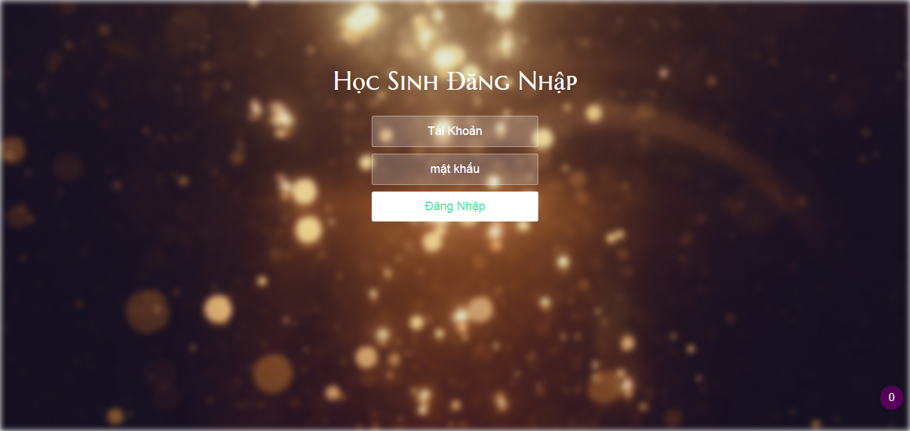
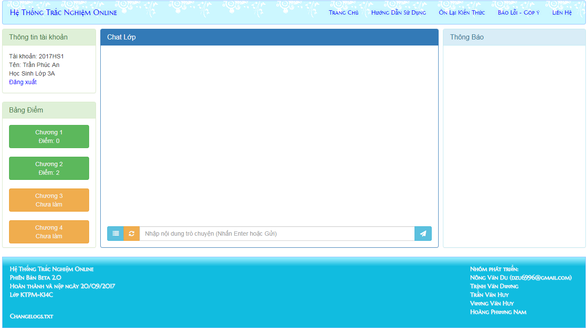
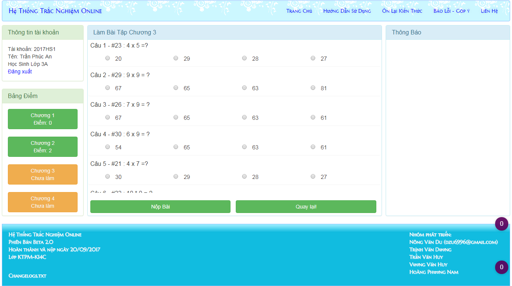
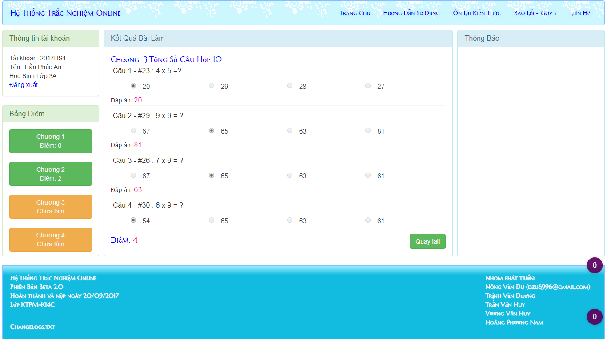
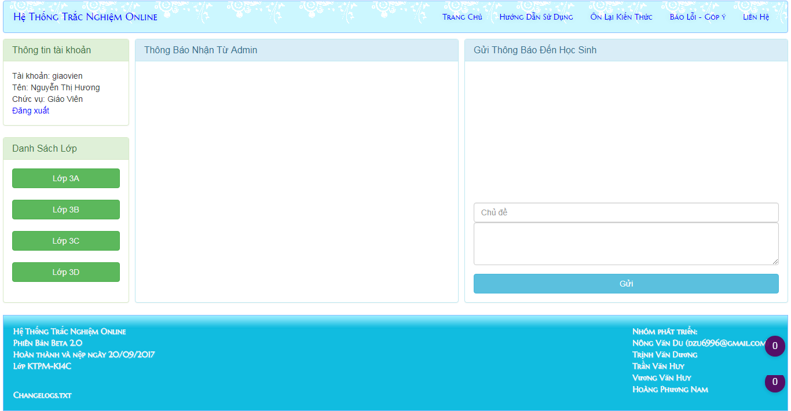
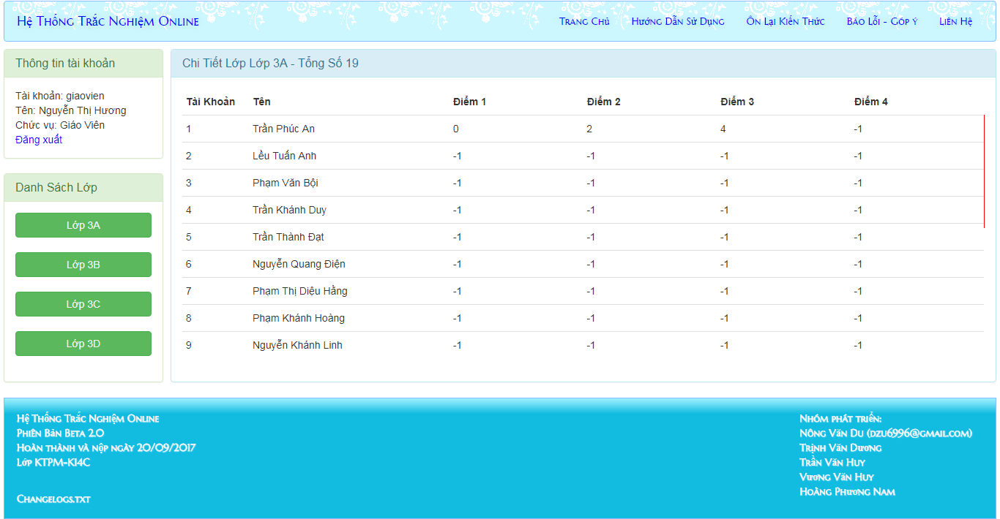
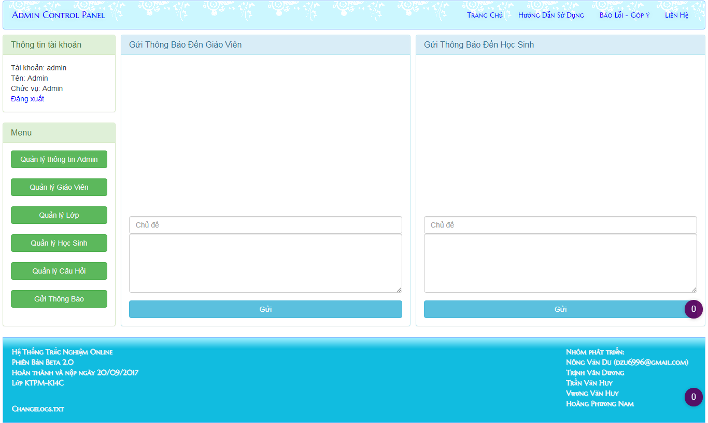

# Hệ Thống Trắc Nghiệm Online
Mục tiêu: Xây dựng hệ thống trắc nghiệm online cho các trường THPT THCS, thay thế cách thức làm bài tập và kiểm tra truyền thống
## Sắp Có

   - Thêm nhiều dạng bài tập hơn
   - Sử dụng biến toàn cục cho các thông tin chung (như version, title...) thay vì viết sẵn vào HTML như hiện tại (tiện cho việc thay đổi nội dung).
   - Fix lỗi XSS các khung nhập dữ liệu vào
   - Thêm kiểm tra và trả về thông báo nếu tài khoản thêm vào bị trùng.
   - Giáo viên có thể thêm học sinh, xoá học sinh, sửa học sinh trong lớp quản lý
   - Thêm 1 vài hoạt động để học sinh kiếm thêm điểm chuyên cần
   - Học sinh, Giáo viên có thể quản lý tài khoản cá nhân (không cần thiết phải qua admin)
   - Học sinh có thể có nhiều hơn 4 chương (hiện thời gian làm xong từng chương)
   - Cập nhật thêm nhiều môn học có thể kiểm tra bằng hình thức trắc nghiệm
## Ảnh Demo (Chụp Từ v2.0.1)
( nút tròn tím có số 0 kia không phải của web đâu nhé :) lúc chụp mình quên tắt extension của chrome đó )

Học Sinh
	
	Đăng nhập

	Trang chủ

	Làm bài tập

	Nộp bài

Giáo Viên

	Đăng nhập

	Trang chủ

	Xem chi tiết lớp

Admin

	Đăng nhập

	Trang quản lý học sinh

	Trang gửi thông báo

## Lưu ý
Trên GitHub chỉ lưu từ v2.0.1 trở đi.
v2.0 và v1.0 mọi người có thể tải file nén về tham khảo ( vì lúc mình bắt đầu làm v1 v2 thì chưa có ý định public lên GitHub)
## v2.0 (19/09/2017)

	- Nâng cấp toàn bộ hệ thống (xây dựng lại bằng OOP PHP trên mô hình MVC )
	- Thuận tiện trong nâng cấp và bảo trì hơn
	- Thay đổi cơ sở dữ liệu phù hợp với phiên bản mới
	- Model Giáo Viên:
		+ Thêm chức năng gửi thông báo đến các lớp đang quản lý
		+ Nâng cấp chức năng xem chi tiết từng lớp
	- Model Học Sinh:
		+ Nâng cấp chức năng làm bài tập trắc nghiệm
		+ Thêm chức năng chát lớp online
		+ Nhận thông báo trực tiếp từ giáo viên quản lý + admin
	- Model Admin:
		+ Gửi thông báo đến các giáo viên
		+ Gửi thông báo đến các lớp
[Download v2.0!](https://drive.google.com/open?id=0B2XjHVJwd5PSdEpObFltbmZzZGc)
## v1.0 (16/05/2017)
	- Xây dựng trên php thuần
	- Cơ sở dữ liệu chỉ dành cho môn toán
	- Hệ thống hướng đến các trường THPT THCS quy mô nhỏ.
	- Giáo Viên:
		+ Xem Điểm Của Học Sinh Trong Các Lớp Đang Quản Lý
	- Học Sinh:
		+ Làm bài tập trắc nghiệm online
	- Admin:
		+ Quản Lý Tài Khoản Admin
		+ Quản Lý Thông Tin Giáo Viên
		+ Quản Lý Thông Tin Lớp Học
		+ Quản Lý Thông Tin Học Sinh
		+ Quản Lý Ngân Hàng Câu Hỏi
[Download v1.0!](https://drive.google.com/open?id=0B2XjHVJwd5PSa0FtWXFMM2xhcjg)
