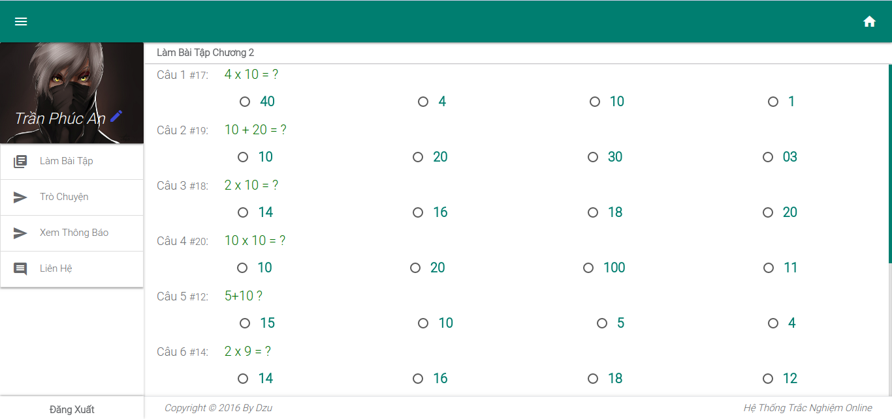

# Hệ Thống Trắc Nghiệm Online

Mục tiêu: Xây dựng hệ thống trắc nghiệm online cho các trường THPT THCS, thay thế cách thức làm bài tập và kiểm tra truyền thống
## Tính Năng
Xem tại [CHANGELOG](CHANGELOG.md) 
## Sắp Có

	- Thêm bảng xếp hạng điểm theo từng lớp
	- Thêm nhiều dạng bài tập hơn
	- Cập nhật thêm nhiều môn học có thể kiểm tra bằng hình thức trắc nghiệm
   
[Hướng dẫn sử dụng](GUIDE.md)
## Ảnh Demo (Chụp Từ v3.1.0)

## Lưu ý
Trên GitHub chỉ lưu từ v2.0.1 trở đi. 
Xem thêm tại [CHANGELOG](CHANGELOG.md) 
v2.0 và v1.0 mọi người có thể tải file nén về tham khảo ( vì lúc mình bắt đầu làm v1 v2 thì chưa có ý định public lên GitHub) 
[Download v2.0 (19/09/2017)!](https://drive.google.com/file/d/0B2XjHVJwd5PSbWhXZWdOcDgyYXM/view?usp=sharing) 
[Download v1.0 (16/05/2017)!](https://drive.google.com/file/d/0B2XjHVJwd5PSejNmN0FfR0N1Tms/view?usp=sharing)