# Hệ Thống Trắc Nghiệm Online

Mục tiêu: Xây dựng hệ thống trắc nghiệm online cho các trường THPT THCS, thay thế cách thức làm bài tập và kiểm tra truyền thống

## Thông Tin

Bản quyền tác giả:  
**Nông Văn Du**  
Email: dzu6996@gmail.com  
Dự án được phát triển và chia sẻ với mục đích phi lợi nhuận.  
Bản quyền thuộc [MIT License](LICENSE)  
Cảm ơn các bạn đã giúp chia sẻ sản phẩm đến các diễn đàn, cộng đồng, groups facebook... Mình rất vui và cảm ơn khi các bạn làm điều đó. Tuy nhiên, hy vọng các bạn có thể ghi rõ bản quyền và link đến github chính thức của dự án để mọi người có thể biết đến và dễ dàng cập nhật phiên bản mới của sản phẩm.  
Chân thành cảm ơn những email đóng góp ý kiến và báo lỗi của mọi người. Hy vọng sẽ ngày càng nhận được nhiều hơn nữa những email góp ý, nhất là những người đang làm và tiếp xúc trực tiếp với môi trường giáo dục. Một lần nữa, chân thành cảm ơn mọi người.  
Nếu bạn cảm thấy sản phẩm hữu ích, có thể nhấn nút "**Star**" ở phía trên bên phải cho dự án. Nếu bạn là một lập trình viên và muốn đóng góp phát triển cho dự án, đừng ngần ngại mà hãy nhấn nút "**Fork**", github và cộng đồng sẽ ghi nhớ và ghi nhận đóng góp của bạn.  
Mọi đóng góp xin liên hệ email tác giả.  
Dự án có sử dụng một số sản phẩm mã nguồn mở:  

-   <https://github.com/Dogfalo/materialize>  
-   <https://github.com/DataTables/DataTables>  
-   <https://github.com/PHPMailer/PHPMailer>
-   <https://github.com/PHPOffice/PhpSpreadsheet>
-   <https://github.com/mathjax/MathJax>
-   <https://github.com/ckeditor/ckeditor-dev>

Thanks to [@Dogfalo](https://github.com/Dogfalo) [@DataTables](https://github.com/DataTables) [@PHPMailer](https://github.com/PHPMailer) [@PHPOffice](https://github.com/PHPOffice) [@mathjax](https://github.com/mathjax) [@ckeditor](https://github.com/ckeditor)  

## Tính Năng

    - Dễ dàng cài đặt và quản lý, không cần kiến thức lập trình
    - Giao diện làm bài trực quan, hỗ trợ hiển thị công thức LaTeX
    - Tự động lưu trạng thái làm bài của học sinh, thoát ra vào lại không bị mất bài đang làm
    - Có thể xem điểm và xem lại bài thi sau khi nộp bài
    - Hỗ trợ nhập công thức bằng LaTeX
    - Hỗ trợ nhập liệu bằng file Excel
    - Có thể xuất file Excel điểm của từng bài thi
    - Câu hỏi phân loại theo mức độ: dễ, khó, trung bình, và phân loại theo chương: 1, 2, 3,...
    - ...  

Còn rất nhiều tính năng nữa mà mình không thể liệt kê hết được, mọi người tự trải nghiệm nhé.  

Xem thêm tại [CHANGELOG](CHANGELOG.md)  

## Sắp Có

    - Thêm tùy chọn nhập bộ câu hỏi từ file word. (Cảm ơn bạn tranphong965@gmail.com)
    - Giáo viên có thể thêm câu hỏi vào ngân hàng đề (admin sẽ duyệt câu hỏi)
    - Thêm người dùng mới "Giáo viên bộ môn" (formype@gmail.com)
    - Hiển thị số tin nhắn chat, thông báo chưa đọc
    - Thêm tự động cập nhật phiên bản phần mềm
    - Thêm logs lưu vết tất cả các thông tin liên quan đến việc thay đổi dữ liệu trong cơ sở dữ liệu
    - Thêm nhiều dạng bài tập trắc nghiệm hơn
    - Hỡ trợ nhiều dạng thông tin có trong câu hỏi hơn như âm thanh, video...

[Hướng dẫn sử dụng](GUIDE.md)

## Ảnh Demo (Chụp Từ v3.3.0)

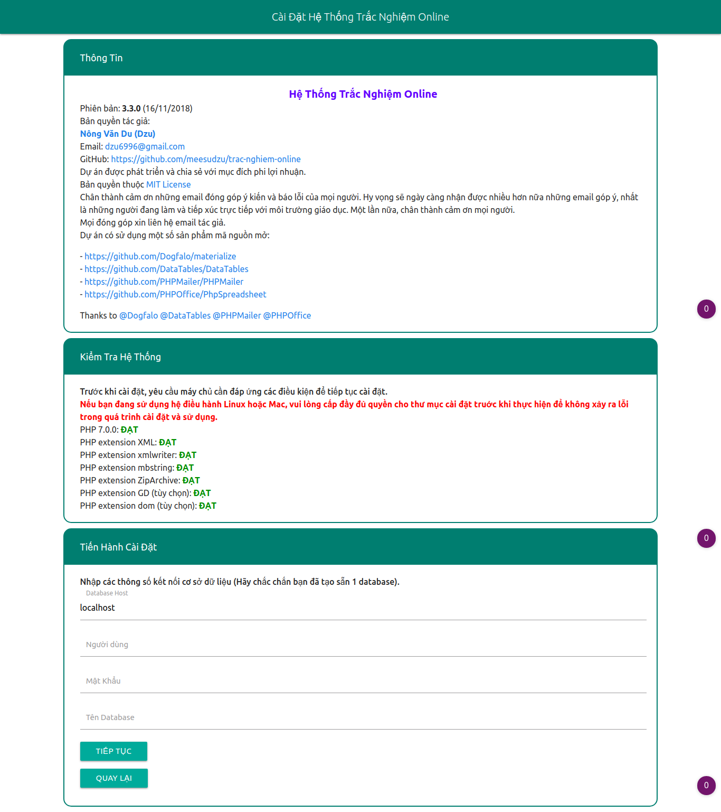
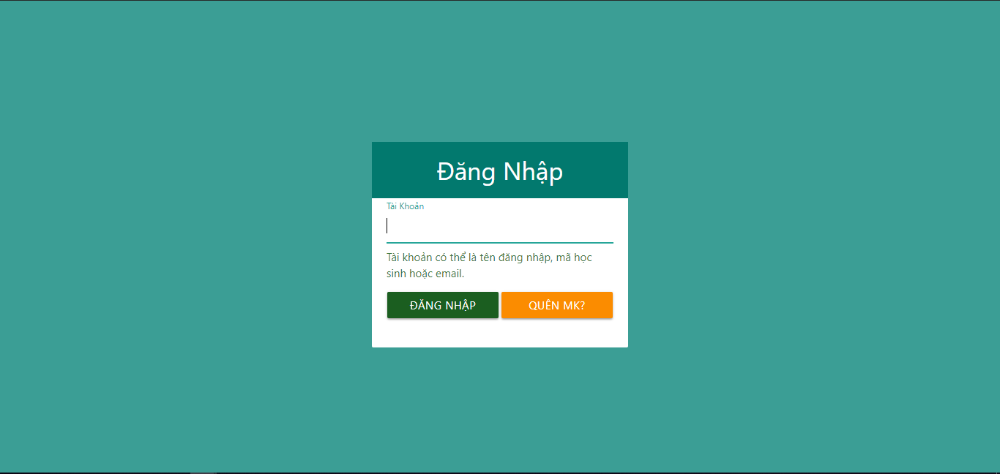
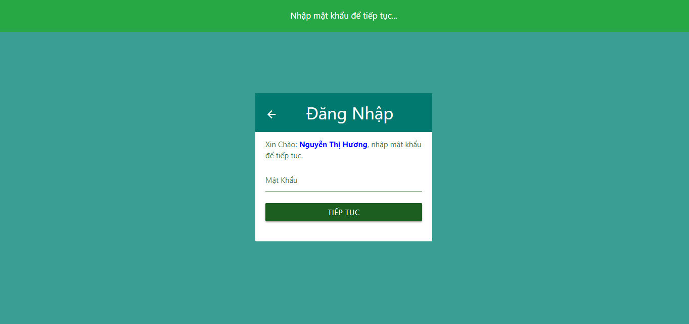
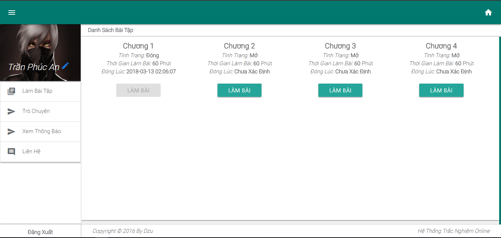
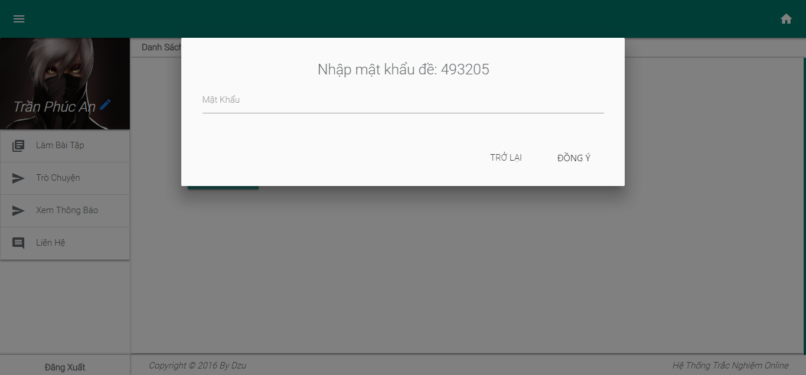
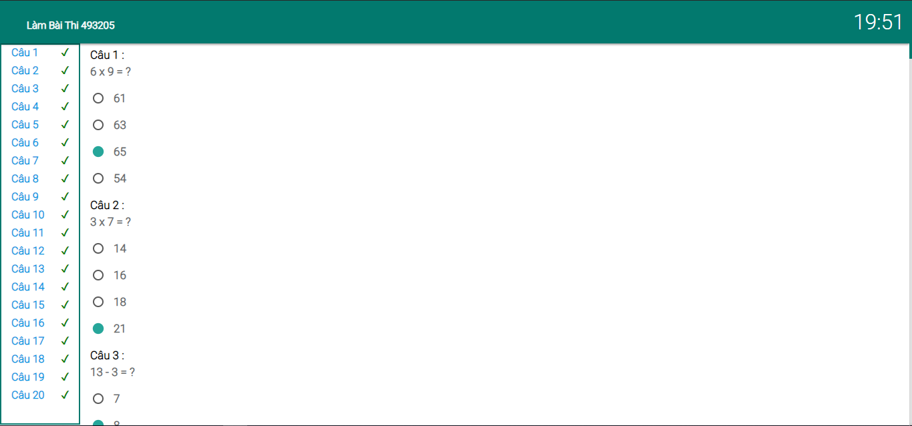
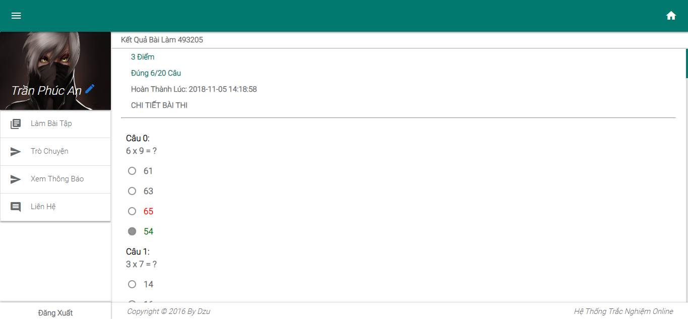
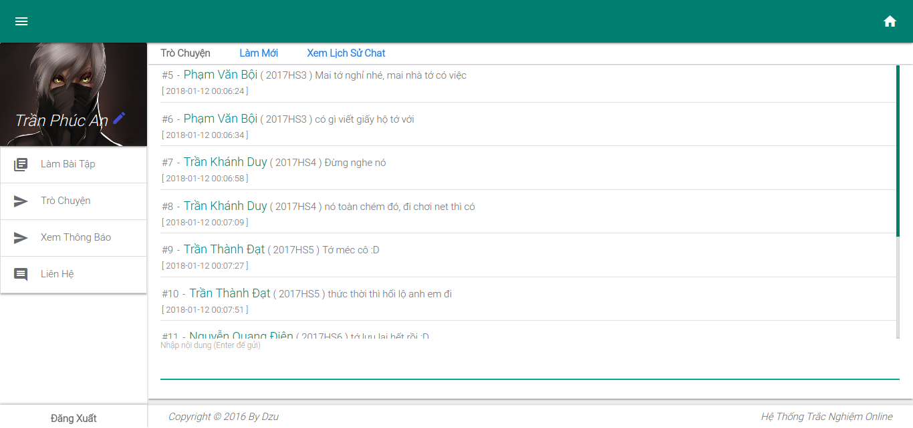
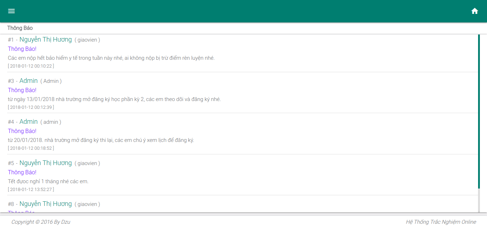
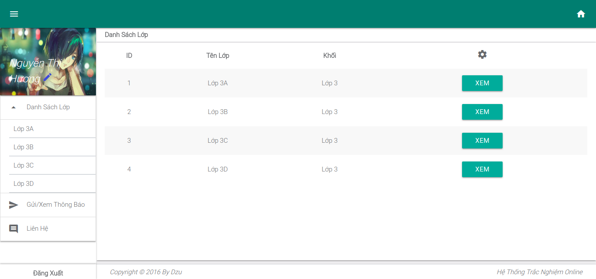
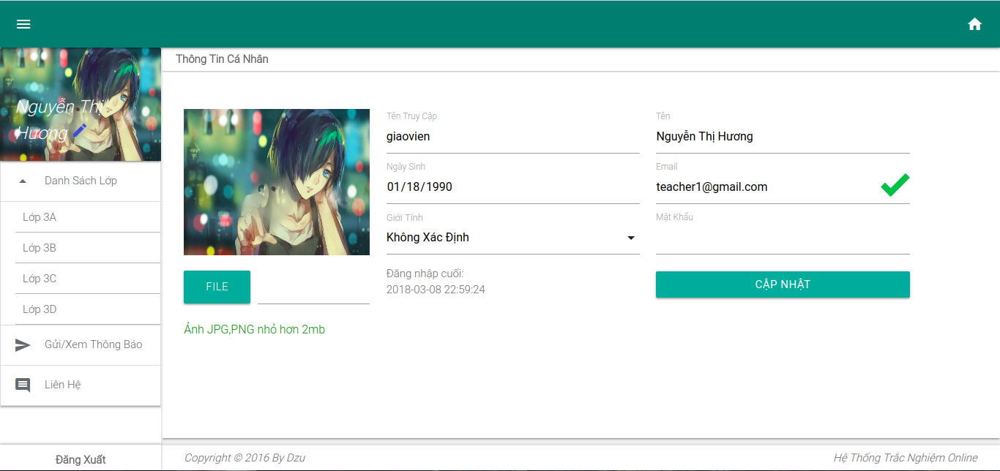
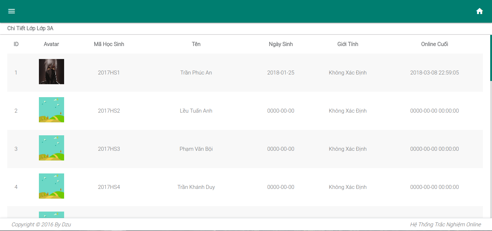
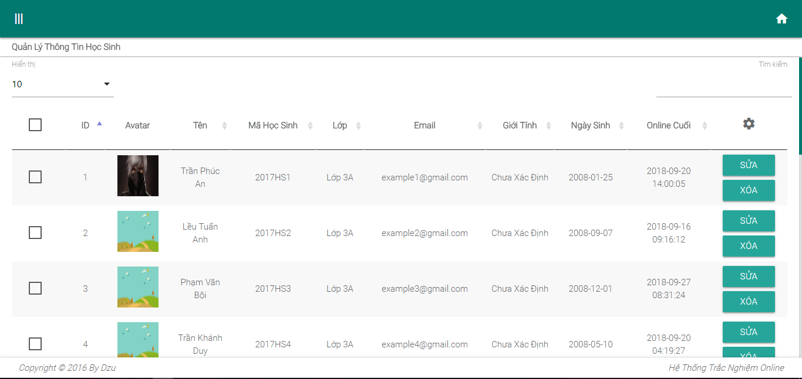
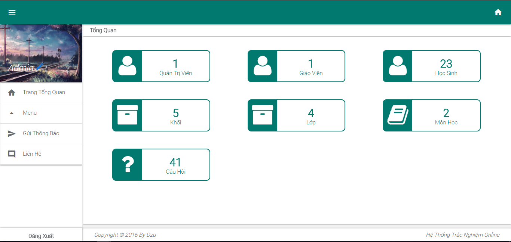
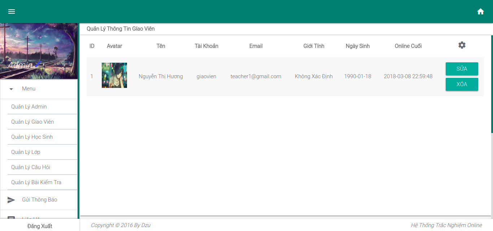
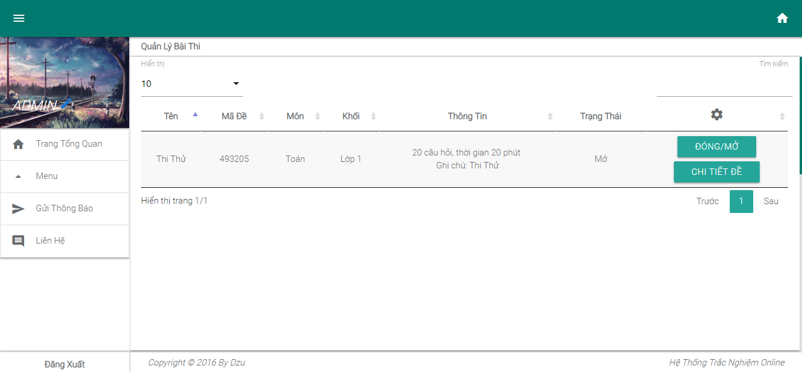

## Lưu ý

Trên GitHub chỉ lưu từ v2.0.1 trở đi.  
v2.0 (19/09/2017)  
v1.0 (16/05/2017)
